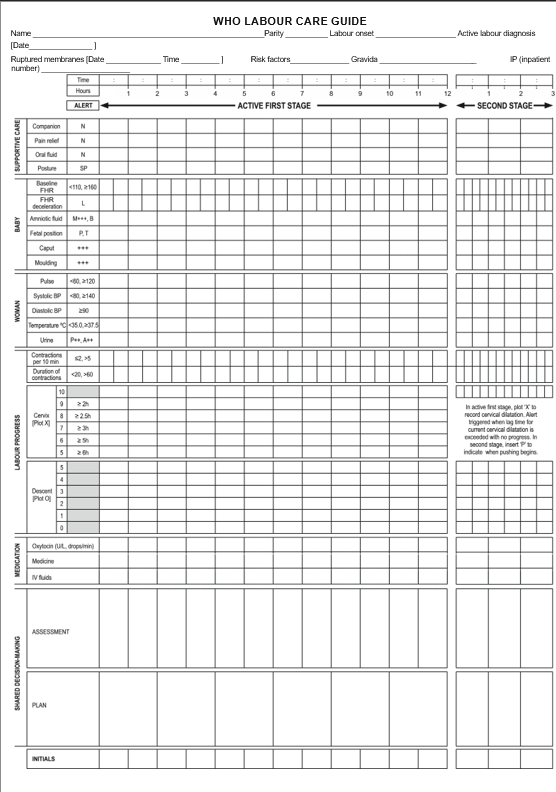
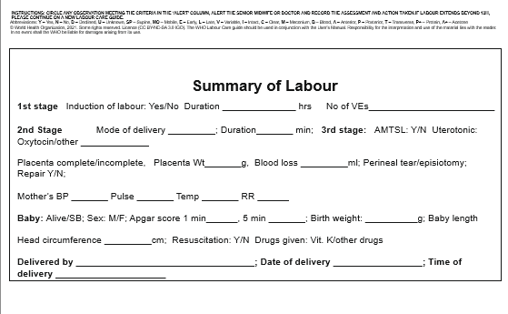

## LCG DEMONSTRATION FORM -Background

A comprehensive Labor Care Guide (LCG) audit was conducted from 23rd June to 2nd July 2026,courtesy of MCGL, marking the first county-wide audit since the introduction of the Labor Care Guide. 

The audit aimed to assess the county's compliance with the national Labor Care Guide guidelines, evaluate the utilization and completeness of LCG documentation, and determine healthcare workers' knowledge and understanding of the various components and indicators of the tool.

The audit was undertaken across selected health facilities providing maternity services, including public, faith-based, and private facilities with inpatient obstetric services, spanning all five sub-counties. 

Labor records were reviewed against the recommended national LCG standards to assess the quality of intrapartum care documentation, identify strengths and gaps in implementation, and generate evidence to inform quality improvement initiatives.

Overall, the audit revealed considerable variation in the utilization and quality of LCG documentation across facilities. While some facilities demonstrated good uptake of the Labor Care Guide, effective teamwork, and adherence to recommended documentation practices, others experienced significant challenges, including incomplete documentation, missing patient files, poor-quality photocopied LCG forms, and inconsistent application of national guidelines. 

Despite these variations, several findings were common across the majority of facilities, highlighting systemic gaps in documentation, clinical decision-making, and adherence to recommended labor monitoring practices.

The findings and recommendations from this audit provide an important baseline for strengthening Labor Care Guide implementation, guiding targeted mentorship and supportive supervision, and improving the quality of intrapartum care across the county.

It is against this backdrop that I found it necessary to develop an interactive demonstration tool that staff can access and navigate at their own convenience. The purpose of this tool is to provide standardized guidance on the correct use of the Labour Care Guide (LCG), enabling all healthcare workers to develop a common understanding of the tool and promoting consistent interpretation and documentation practices across all facilities.
